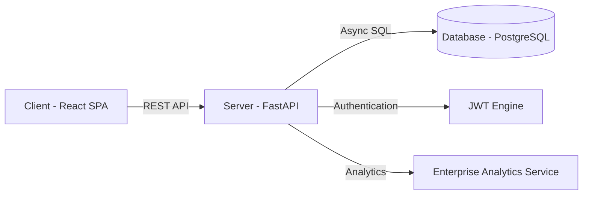

# SPARK - Scalable Production-Grade Analytics for Academic Records & Knowledge

## 1. Project Overview

**Project Name:** SPARK
**Problem Statement:** Academic institutions often struggle with fragmented or simplistic student performance data, making it difficult to identify students at risk, analyze faculty impact, or provide holistic academic insights for career readiness.
**Purpose of the System:** SPARK is a robust, production-ready analytics платфорm designed to consolidate student academic records, attendance, and faculty data into actionable insights for students and administrators. It provides a "360-degree" view of individual performance and "Executive" dashboards for institution-wide monitoring.
**Key Features:**
*   **Student Dashboard:** Comprehensive academic history, SGPA/CGPA trends, attendance analytics, and risk indicators.
*   **Admin Command Center:** Real-time institutional health metrics, department/batch performance summaries, and spotlight search for rapid entity discovery.
*   **Advanced Analytics:** Predictive risk scoring (Critical/High/Moderate/Low), placement readiness assessment, and faculty impact matrix.
*   **Automated Reporting:** Batch summary exports (Excel) and student grade sheets (PDF).
*   **RBAC (Role-Based Access Control):** Secure tiers for Admin, Staff, and Students.

**Target Users:** Students, Academic Faculty, Department Heads, and Institutional Administrators.

---

## 2. Tech Stack

### Frontend
*   **React 19:** Functional components with modern hooks and state management.
*   **Vite 7:** High-performance build tool and development server.
*   **Tailwind CSS 4:** Modern utility-first styling for premium UI/UX.
*   **Zustand:** Lightweight state management for authentication and session persistence.
*   **TanStack React Query:** Concurrent data fetching and automated cache management.
*   **Lucide React:** Iconography system.
*   **Recharts:** Interactive data visualization and performance trends.

### Backend
*   **FastAPI:** High-performance Python framework for building modern Web APIs.
*   **SQLAlchemy 2.0:** Asynchronous ORM for database interactions.
*   **Pydantic 2.0:** Data validation and schema settings.
*   **Python-Jose:** JWT token processing for authentication.
*   **Passlib:** Secure password hashing (BCrypt).

### Database
*   **PostgreSQL 15:** Relational database for structured academic and user data.

### Infrastructure / Hosting
*   **Docker & Docker Compose:** Containerization for consistent development and deployment environments.
*   **Render:** Production platform for hosting the FastAPI backend and PostgreSQL database.
*   **Vercel:** Production hosting for the React frontend with edge-optimized delivery.

---

## 3. System Architecture

SPARK follows a modern decoupled architecture where the frontend communicates with the backend via a RESTful JSON API.

### High-Level Architecture Flow



### Authentication Flow
1.  **Login:** User submits credentials (roll_no/username).
2.  **Verification:** Backend validates credentials against hashed passwords in the DB.
3.  **Token Issuance:** Backend returns `access_token` and `refresh_token`.
4.  **Authorized Requests:** Client includes `Bearer` token in the `Authorization` header.
5.  **Role Guard:** Backend middleware checks token and user role (Admin/Student) before allowing access to specific routes.

---

## 4. Folder Structure

```
/automation
├── backend/                # FastAPI Application
│   ├── app/
│   │   ├── api/            # API Route definitions
│   │   ├── core/           # Config, database setup, auth logic
│   │   ├── models/         # SQLAlchemy DB models
│   │   ├── schemas/        # Pydantic data validation schemas
│   │   ├── services/       # Business logic & Analytics services
│   │   └── main.py         # Application entry point
│   ├── data/               # Seed data and JSON snapshots
│   ├── Dockerfile          # Backend container setup
│   └── requirements.txt    # Python dependencies
├── frontend/               # React Application
│   ├── src/
│   │   ├── components/     # Reusable UI components
│   │   ├── pages/          # Main route components (Dashboard, Login, Admin)
│   │   ├── api/            # Axios client and interceptors
│   │   ├── store/          # Zustand state stores
│   │   └── main.jsx        # Frontend entry point
│   ├── Dockerfile          # Frontend container setup
│   └── package.json        # Frontend dependencies
├── docker-compose.yml      # Multi-container orchestration
└── schema.sql              # Core PostgreSQL schema
```

---

## 5. Backend Documentation

### Framework & Structure
The backend is built with **FastAPI** utilizing an asynchronous operational model. Business logic is strictly separated into the `services/` layer, while data exposure is managed through standard API routes in `api/endpoints/`.

### Key Services
*   **StudentService:** Handles individual record retrieval, SGPA/CGPA calculations, and risk assessment logic.
*   **EnterpriseAnalytics:** Processes complex SQL queries for institution-wide dashboards, including heatmaps and drift analysis.
*   **UserService:** Manages profile updates and password security.

### Primary API Endpoints

| Endpoint | Method | Description | Role |
| :--- | :--- | :--- | :--- |
| `/api/auth/login` | POST | Authenticate and get JWT token | Public |
| `/api/students/performance/{roll_no}` | GET | Holistic student performance history | Student/Admin |
| `/api/students/attendance/{roll_no}` | GET | Detailed paginated attendance records | Student/Admin |
| `/api/admin/command-center` | GET | Institutional real-time status matrix | Admin |
| `/api/admin/risk-registry` | GET | Ranked list of students requiring intervention | Admin |
| `/api/admin/export/batch-summary` | GET | Download batch analysis in XLSX | Admin |

---

## 6. Frontend Documentation

### UI Architecture
The UI is built with **React** using a modular component patterns. It leverages **Vite** for HMR (Hot Module Replacement) and **Tailwind CSS** for a sleek, responsive design that adapts to desktop and mobile devices.

### State Management
*   **Zustand:** Stores the current session (`user`, `token`, `role`) and basic UI preferences.
*   **React Query:** Hooks like `useQuery` managed the lifecycle of API data, providing loading states, automatic caching, and background refetching.

### Routing
**React Router 7** handles the frontend navigation:
*   `/login`: Secure authentication portal.
*   `/dashboard`: Personal analytics for logged-in students.
*   `/admin`: Executive dashboard accessible only to administrative roles.

---

## 7. Database Design

### Normalization
The database follows **3NF (Third Normal Form)** to minimize redundancy and maintain data integrity.

### Primary Models

| Model | Table | Purpose | Relationships |
| :--- | :--- | :--- | :--- |
| `User` | `users` | Core identity and AUth | Role |
| `Student` | `students` | Profile & biographical data | User, Program |
| `Subject` | `subjects` | Master curriculum data | Program |
| `StudentMark`| `student_marks`| Results for individual subjects | Student, Subject |
| `Attendance` | `attendance` | Daily attendance logs | Student |

---

## 8. Important Workflows

### 1. Student Analytical Pipeline
1.  Frontend requests `/analytics/{roll_no}`.
2.  `StudentService` fetches raw marks and attendance from DB.
3.  Logic calculates SGPA, CGPA proxy, and detects "Risk Subjects" (e.g., Internals < 60% or Grade ≤ B).
4.  Data is returned to the UI and visualized via interactive charts.

### 2. Admin Real-time Search (Spotlight)
1.  User starts typing in the search bar.
2.  Frontend triggers a debounced request to `/api/admin/spotlight-search`.
3.  Backend performs a `UNION ALL` fuzzy search across `students`, `staff`, and `subjects`.
4.  Instant results allow one-click navigation to student 360-degree profiles.

---

## 9. Environment Setup

### Required Tools
*   **Python 3.10+**
*   **Node.js 18+**
*   **Docker & Docker Compose**

### Installation Steps
1.  **Clone the repository.**
2.  **Configure `.env`:**
    ```bash
    # /backend/.env
    DATABASE_URL=postgresql+asyncpg://postgres:postgres@db:5432/spark
    SECRET_KEY=your_secure_secret_key
    ```
3.  **Run with Docker Compose:**
    ```bash
    docker-compose up --build
    ```
4.  **Seed Data (Optional):**
    ```bash
    cd backend
    python seed_db.py
    ```

---

## 10. Deployment

### Production Strategy
*   **API:** Hosted on **Render** (via Dockerfile). Integrated with GitHub for automatic CD.
*   **Frontend:** Hosted on **Vercel**. Environment variables must be set (`VITE_API_URL`).
*   **Database:** Managed **PostgreSQL** instance on Render or AWS RDS.

---

## 11. Future Improvements

1.  **Push Notifications:** Integrate Firebase to notify students of low attendance or new result updates.
2.  **ML-Driven Risk Prediction:** Replace static thresholds with a machine learning model to better predict dropouts.
3.  **Faculty Portal:** Dedicated dashboard for staff to manage their assigned subject records directly.
4.  **Advanced PDF Generation:** Shift to a specialized PDF engine (ReportLab or Puppeteer) for more customizable and secure report generation.
