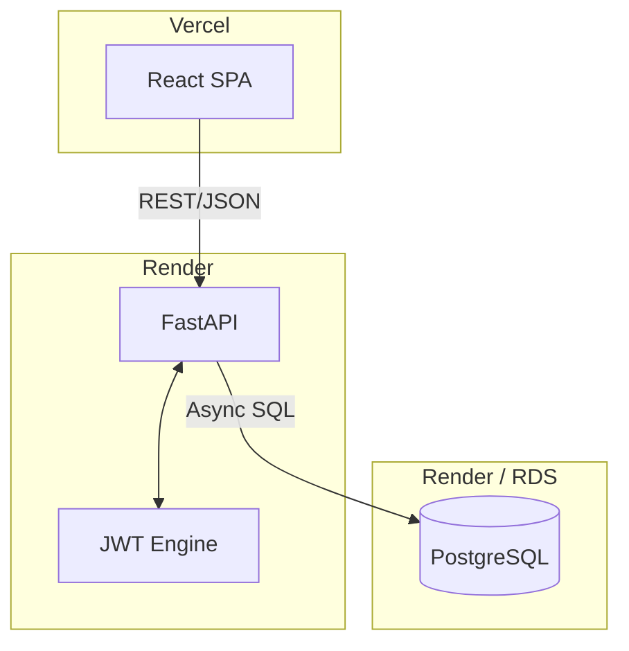

# SPARK: Scalable Production-Grade Analytics for Academic Records & Knowledge

SPARK is a comprehensive, production-ready educational analytics platform designed to track, analyze, and visualize student academic performance, attendance, and placement readiness. It provides a data-driven command center for administrators and detailed performance 360 views for students.

---

## 🚀 Tech Stack

### Backend
- **Core**: [FastAPI](https://fastapi.tiangolo.com/) (Python 3.10+)
- **Database**: [PostgreSQL](https://www.postgresql.org/) with [SQLAlchemy](https://www.sqlalchemy.org/) (Async)
- **Security**: 
  - JWT Authentication (Access + Refresh Token Rotation)
  - Refresh token revocation on logout
  - CORS dynamic origin management
  - Rate limiting via [SlowAPI](https://slowapi.readthedocs.io/)
- **Data Handling**: [Pandas](https://pandas.pydata.org/) for complex analytics and Excel/PDF generation.

### Frontend
- **Core**: [React 19](https://react.dev/) (Vite-based)
- **Styling**: [Tailwind CSS 4](https://tailwindcss.com/)
- **State Management**: [Zustand](https://github.com/pmndrs/zustand)
- **Data Fetching**: [TanStack Query v5](https://tanstack.com/query/latest)
- **Visualization**: [Recharts](https://recharts.org/)
- **Observability**: [Sentry](https://sentry.io/) for frontend error tracking.
- **Feature Set**: PWA support (Workbox), Error Boundaries, WCAG compliance.

---

## 📂 Project Structure

```text
.
├── backend/                # FastAPI application
│   ├── app/
│   │   ├── api/            # API Endpoints (Auth, Students, Admin)
│   │   ├── core/           # Security, Database config, Limiter
│   │   ├── models/         # SQLAlchemy DB Models (PostgreSQL)
│   │   ├── schemas/        # Pydantic models for validation
│   │   ├── services/       # Business logic (Analytics, Student, Admin)
│   │   ├── scripts/        # Utility scripts (Backups, Migrations)
│   │   ├── migrations/     # Alembic database migrations
│   │   └── main.py         # Entry point (Sentry initialized, Health checks)
│   ├── requirements.txt    # Backend dependencies
│   └── docker-compose.yml  # Infrastructure setup
├── frontend/               # React application
│   ├── src/
│   │   ├── components/     # UI Components (Sidebar, Charts, etc.)
│   │   ├── pages/          # Main Views (Login, Dashboard, Admin)
│   │   ├── store/          # Zustand state global stores
│   │   ├── hooks/          # Custom React hooks (auth, etc.)
│   │   └── api/            # Axios client and API services
│   ├── package.json        # Frontend dependencies
│   └── vite.config.ts      # Vite configuration
└── data/                   # Data storage for analytics engine
```

---

## 🏛️ Architecture & Features

### System Architecture (Current vs Target)

#### Current Architecture


#### Production-Grade Roadmap (Target)
```mermaid
graph TD
    subgraph Client [Client Layer]
        SPA[React SPA]
        PWA[Mobile PWA (Future)]
    end

    subgraph Edge [Edge Layer]
        GW[API Gateway]
    end

    subgraph Business [Application Layer]
        API[FastAPI Business Logic]
        Auth[Auth Service JWT+RBAC]
    end

    subgraph Data [Data Layer]
        Cache[(Redis Cache)]
        DB[(PostgreSQL Primary+Replica)]
    end

    subgraph Background [Background Layer]
        Queue[Task Queue Celery]
    end

    subgraph Ops [Observability]
        Obs[Logs/Metrics/Traces]
    end

    SPA --> GW
    PWA --> GW
    GW -- "Rate Limit / CORS" --> API
    GW <--> Auth
    API --> Cache
    Cache --> DB
    DB --> Queue
    Queue --> Obs
```

> [!NOTE]
> The current architecture is a clean starting point but lacks production-critical layers like caching, task queues, and integrated observability. We are actively moving towards the target architecture defined above.

### 1. Security First
- **Token Rotation**: Every refresh token request issues a new refresh token and revokes the old one (JTI-based rotation).
- **Rate Limiting**: Critical endpoints (Analytics, Exports) are limited to prevent abuse.
- **SQL Injection Prevention**: All dynamic queries use bound parameters and safe regex casting.

### 2. Analytics Engine
- **Risk Score Logic**: Calculates a real-time risk score based on SGPA trends, internal marks, and attendance.
- **Placement Readiness**: Evaluates students based on CGPA thresholds and coding-related subject performance.
- **Subject Bottlenecks**: Identifies subjects with high failure rates or significant performance drift from historical averages.

### 3. Progressive Web App (PWA)
- **Offline-First**: Service worker implements `Stale-While-Revalidate` for API and `Cache-First` for static assets.
- **Robustness**: Global `ErrorBoundary` catches runtime failures and provides auto-recovery options.
- **Inclusive Design**: WCAG compliant with full ARIA support and semantic HTML.

### 4. Observability & DevSecOps
- **Error Tracking**: Full Sentry integration on both Backend and Frontend.
- **Automated Backups**: Daily database snapshots via automated Python scripts.
- **Health Monitoring**: Deep health checks verifying database connectivity and service status.
- **CI/CD Ready**: Integrated Vitest (Unit) and Playwright (E2E) testing suites.

---

## 🛠️ Setup & Development

### Backend
1. Create a `.env` file with `DATABASE_URL` and `SECRET_KEY`.
2. Install dependencies: `pip install -r requirements.txt`.
3. Run the server: `uvicorn app.main:app --reload`.

### Frontend
1. Install dependencies: `npm install`.
2. Start development server: `npm run dev`.

---

## 📈 Recent Enhancements (v2.1.0)
- **Production Roadmap Complete**: Implemented all 5 phases of security, robustness, observability, testing, and polish.
- **API v1**: Versioned REST API with pagination and standardized response schemas.
- **Frontend Polish**: Integrated global Error Boundaries and accessibility labels.
