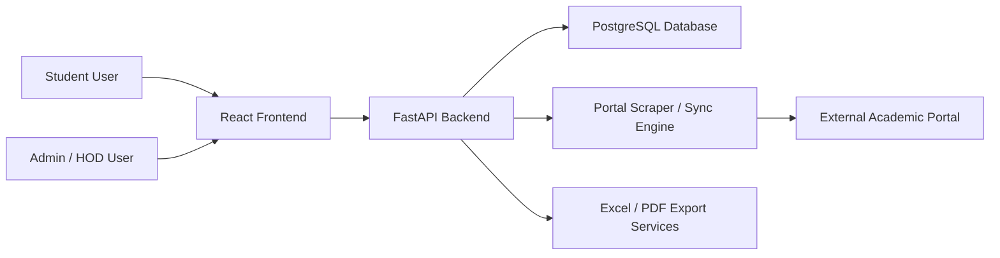
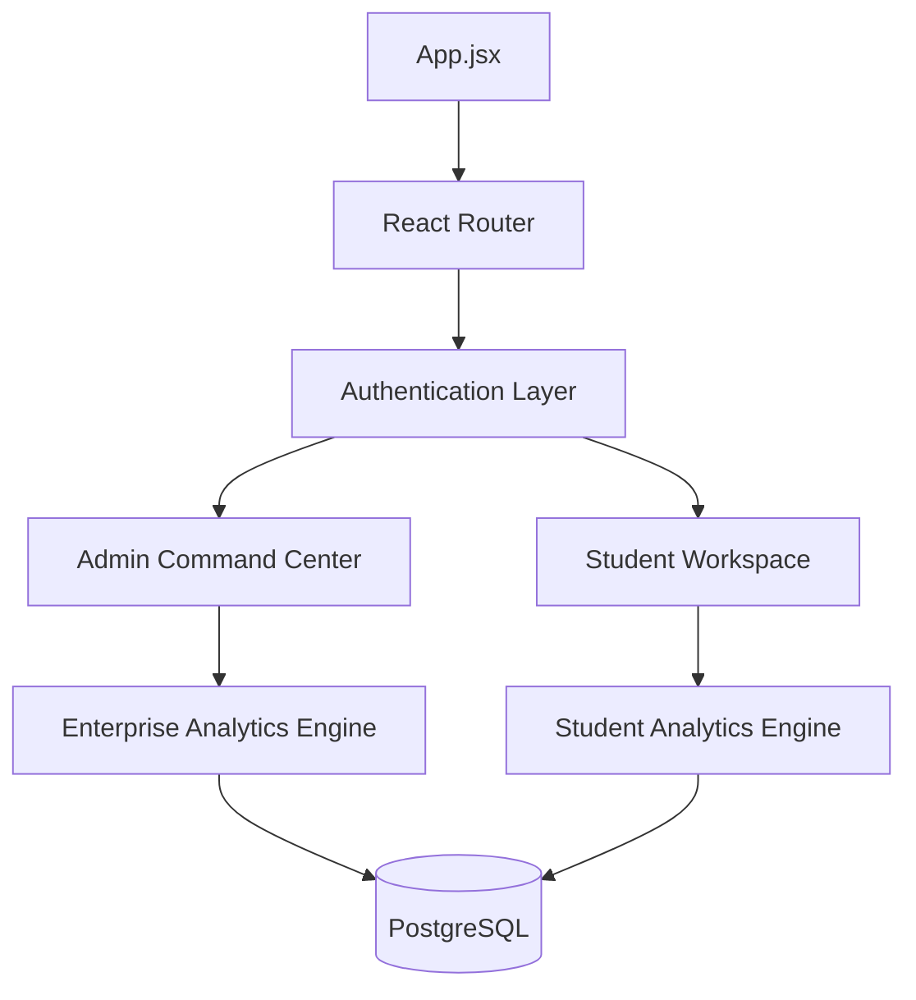

# Spark Academic Intelligence Platform: Engineering SOP

> [!IMPORTANT]
> This document is the primary Standard Operating Procedure (SOP) for developers working on Spark. It covers the technical lifecycle, architectural patterns, and operational standards.

---

## 1. Project Lifecycle & Environment

### Prerequisites
- **Node.js**: v18+ (LTS)
- **Python**: 3.10+
- **Docker & Docker Compose**: For local database orchestration.
- **PostgreSQL**: 15+ (if running natively).

### Local Setup
1. **Infrastructure**: Start the database container.
   ```powershell
   docker-compose up -d db
   ```
2. **Backend**:
   ```powershell
   cd backend
   python -m venv .venv
   .\.venv\Scripts\activate
   pip install -r requirements.txt
   uvicorn app.main:app --reload
   ```
3. **Frontend**:
   ```powershell
   cd frontend
   npm install
   npm run dev
   ```

### Startup Hook
The backend utilizes an `initialize_schema()` and `ensure_legacy_tables()` hook in `main.py` on startup to ensure persistence consistency across local and production environments.

---

## 2. Engineering Standards

### Backend (FastAPI + Async SQLAlchemy)
- **Asynchronicity**: All database operations **must** use `async/await` with `AsyncSession`. Avoid synchronous calls that block the event loop.
- **Type Safety**: Pydantic models (in `schemas.py`) are mandatory for all request/response payloads.
- **Dependency Injection**: Use `Depends(get_db)` for session management to ensure proper cleanup.
- **Error Handling**: Use custom HTTPException subclasses for consistent API error responses.

### Frontend (React + Vite)
- **State Management**: Prefer **TanStack Query** (React Query) for server state. Avoid lifting complex state unless necessary.
- **Data Tables**: Use **TanStack Table** for all administrative grids to support complex filtering and pagination.
- **Visuals**: Use **Recharts** for performance analytics. Maintain a "Premium UI" feel with glassmorphism and subtle animations.
- **Consistency**: All API calls should route through `frontend/src/utils/api.js` using the configured Axios instance.

---

## 3. High-Level Architecture

### System Context


### Runtime Data Flow


---

## 4. Data Model & Analytics

### Core Schema Operations
- **Normalized Tables**: `users`, `students`, `programs`, `subjects`, `student_marks`, `attendance`.
- **Legacy Integration**: Spark maintains compatibility with imported academic systems via `semester_grades` and `counselor_diary`.
- **Relationship Integrity**: All new features must maintain the `USER` -> `STUDENT/STAFF` mapping.

### Analytics Strategy
We maintain two engines for performance reasons:
1. **Analytics Service**: Real-time rollups for dashboard metrics.
2. **Enterprise Engine**: Complex SQL (CTEs, Window Functions) for batch ranking, bottlenecks, and "Student 360" views.

---

## 5. Development Workflow (SOP)

### Branching & PRs
- **Feature Branches**: `feat/feature-name`, `fix/bug-name`.
- **PR Expectations**:
  - Senior review required for `backend/app/models.py` or `enterprise_analytics.py` changes.
  - Mermaid diagrams must be updated if routing or data flow changes.

### Quality Assurance (QA)
- **Unit Testing**: Required for complex analytics logic in `analytics_service.py`.
- **Integration Testing**: Verify API endpoints using `pytest` and `httpx`.
- **UI Validation**: Ensure responsive design across mobile and desktop breakpoints (MobileNav is a key component).

---

## 6. Operational Playbooks

### Syncing Data
- **Student-Initiated**: Triggered via `POST /scrape/{roll_no}` with DOB verification.
- **Admin Bulk Sync**: Managed through `/api/sync/all`. This is a high-resource operation and should be run during off-peak hours.

### Exporting Reports
Generating `.xlsx` and `.pdf` reports is handled by separate services in the backend. Ensure `static` directories for temporary file generation are correctly mapped in Docker volumes.

---

## 7. Product Vision (Reference)

- **Student Persona**: Goal is clarity on performance and risk mitigation.
- **Admin Persona**: Goal is department-wide intelligence and intervention efficiency.
- **Primary Value**: Reducing manual review time and enabling early identification of academic risk.

---

## 8. Maintenance & Constraints
- **Credit Maps**: Currently hardcoded in backend constants; plan for migration to DB-driven credits.
- **Legacy Coexistence**: Be mindful of differences between `InternalMarks` and `SemesterGrades` schemas when writing analytics.
- notification workflow for high-risk students
- intervention history tracking
- approval / audit trail for manual record edits

### Platform side

- move curriculum credits to managed table
- unify legacy and enterprise analytics contracts
- add stronger endpoint-level test coverage
- add role-specific monitoring dashboards

---

## 23. Summary

Spark currently operates as a two-sided academic intelligence system:

- students get a self-service academic command center
- admins get a department-level HOD command center

Its real power comes from combining:

- imported academic records
- operational data
- async APIs
- SQL analytics
- role-based frontend workflows

This makes Spark not just a marks viewer, but an academic operations platform.

