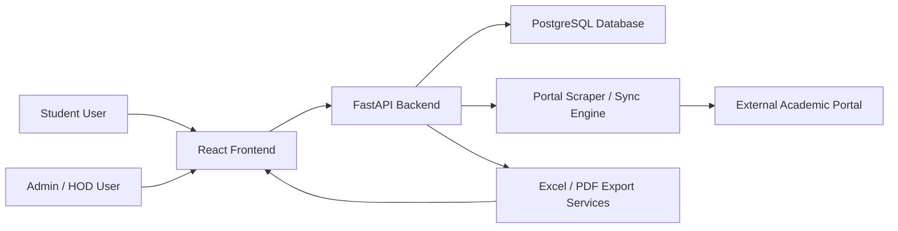
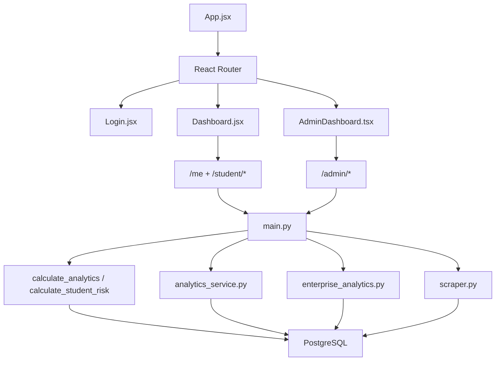
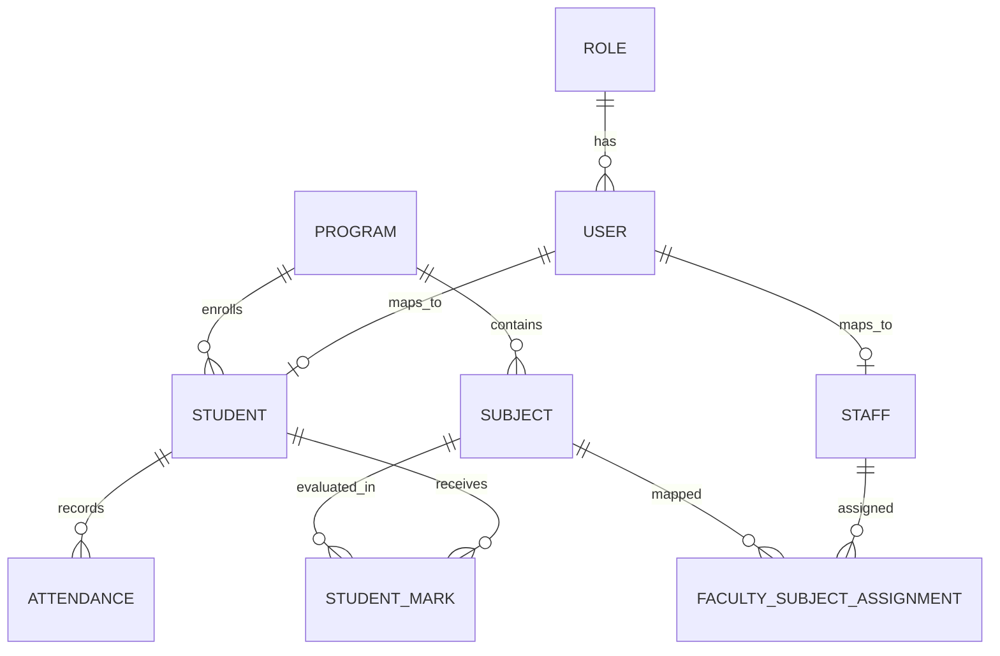
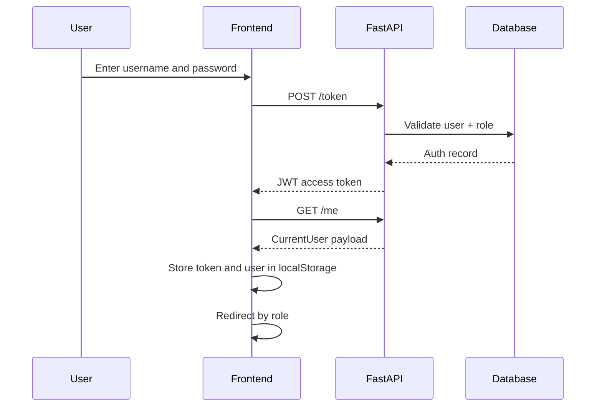
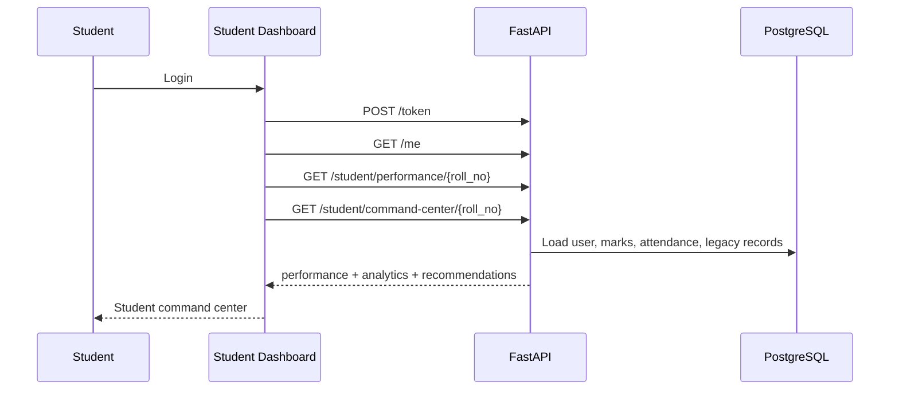
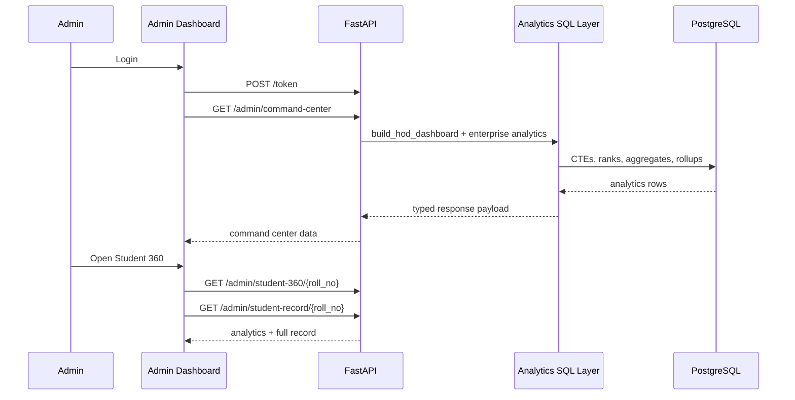

# Spark Workflow

## 1. Document Purpose

This document is the combined:

- workflow guide
- system architecture reference
- lightweight PRD
- implementation map

for the Spark Academic Intelligence Platform in `C:\Users\devel\automation`.

It explains how the system works end to end for:

- students
- admins / HOD
- backend services
- analytics generation
- sync/import pipelines
- exports

---

## 2. Product Summary

### Product name

Spark Academic Intelligence Platform

### Primary objective

Provide a fast, role-based MCA academic operations system where:

- students can log in and understand their academic performance clearly
- admins can monitor the entire department through a command center
- synced academic data is transformed into actionable analytics

### Core value proposition

- turn academic records into decisions
- reduce manual result review
- identify risk early
- improve intervention speed
- expose rank, performance, attendance, placement, and bottleneck intelligence

---

## 3. Personas And Goals

### Student

Goals:

- log in safely
- see own grades, attendance, and academic trend
- understand weaknesses and strengths
- know current risk level
- see what to improve next
- sync latest records from source portal

### Admin / HOD

Goals:

- monitor department health
- review high-risk students quickly
- compare subject performance
- identify bottlenecks and red zones
- inspect student 360 details
- export summaries and reports
- browse entire student registry

### Faculty / Staff

Currently indirect in workflow:

- faculty data contributes to impact matrix when assignments are available
- staff accounts can exist in auth and data model

---

## 4. Stack Overview

### Frontend

- React
- Vite
- React Router
- TanStack Query
- TanStack Table
- Recharts
- utility-first CSS styling

Important frontend files:

- `frontend/src/App.jsx`
- `frontend/src/pages/Login.jsx`
- `frontend/src/pages/Dashboard.jsx`
- `frontend/src/pages/AdminDashboard.tsx`
- `frontend/src/components/StudentProfile360.tsx`
- `frontend/src/components/SpotlightSearch.tsx`
- `frontend/src/utils/api.js`

### Backend

- FastAPI
- Async SQLAlchemy
- PostgreSQL
- Pydantic schemas

Important backend files:

- `backend/app/main.py`
- `backend/app/models.py`
- `backend/app/schemas.py`
- `backend/app/analytics_service.py`
- `backend/app/enterprise_analytics.py`
- `backend/app/database.py`
- `backend/app/auth.py`
- `backend/app/scraper.py`

---

## 5. System Context Diagram

---

## 6. High-Level Runtime Architecture

---

## 7. Core Data Model

### Normalized tables

- `roles`
- `users`
- `students`
- `staff`
- `programs`
- `subjects`
- `student_marks`
- `attendance`
- `faculty_subject_assignments`

### Legacy / imported tables

- `semester_grades`
- `internal_marks`
- `contact_info`
- `family_details`
- `previous_academics`
- `extra_curricular`
- `counselor_diary`

### Relationship model

### Important design note

The project uses both:

- normalized operational tables like `student_marks`
- legacy imported tables like `semester_grades`

This means Spark serves both:

- live app workflows
- imported academic history workflows

---

## 8. Startup Workflow

When backend starts:

1. `FastAPI` app is created in `main.py`
2. lifespan hook runs `initialize_schema()`
3. SQLAlchemy metadata is created
4. legacy tables are ensured by `ensure_legacy_tables()`
5. middleware is registered
6. API becomes available

Key behavior:

- CORS enabled
- request logging middleware prints request and response status
- curriculum credit map is loaded from constants in backend

---

## 9. Authentication Workflow

### Login flow

### Role logic

- `admin` goes to `/admin`
- `student` goes to `/dashboard`

### Session persistence

Frontend restores:

- `user`
- `token`
- theme
- mobile navigation state

from local storage during app boot.

---

## 10. Frontend Workflow

### App shell

Main routing lives in:

- `frontend/src/App.jsx`

Flow:

1. app loads stored user
2. app loads stored theme
3. app checks token existence
4. app renders correct route
5. app mounts `MobileNav` for authenticated users

### Route map

- `/login`
- `/dashboard`
- `/admin`

### Query layer

Frontend uses React Query to:

- cache API results
- reduce repeated network calls
- improve perceived speed
- invalidate affected queries after sync or profile updates

---

## 11. Student Workflow

### 11.1 Student login and landing

Student logs in through `Login.jsx`.

After login, student lands on:

- `/dashboard`

### 11.2 Student data loading flow

Dashboard currently loads:

- `GET /me`
- `GET /student/performance/{roll_no}`
- `GET /student/command-center/{roll_no}`

### 11.3 Student dashboard features

Student-facing features currently include:

- academic overview
- predicted path / GPA trend
- risk assessment
- placement readiness indicator
- attendance summary
- backlog count
- subject repository
- semester and grade filters
- grade distribution chart
- weak areas panel
- strength subjects
- priority watchlist subjects
- semester focus
- recent result flow
- recommended actions
- record health / completeness
- profile editing
- password change

### 11.4 Student sync flow

Student can trigger:

- `POST /scrape/{roll_no}?dob=...`

Purpose:

- verify DOB
- fetch latest portal data
- persist refreshed academic records
- refresh frontend command center

### 11.5 Student command center workflow

`/student/command-center/{roll_no}` combines:

- `calculate_analytics()`
- `calculate_student_risk()`
- `build_full_student_record()`

and returns:

- metrics
- risk profile
- recommended actions
- semester focus
- recent result list
- record health

### 11.6 Student analytics rules

Student analytics compute:

- weighted grade point average
- semester SGPA trend
- attendance insight
- backlog count
- risk subjects
- strength subjects
- risk score

Important rule:

- lab exams and audit courses do not contribute fake zero internal marks
- missing internal marks for those categories are treated as not applicable

---

## 12. Admin / HOD Workflow

### 12.1 Admin landing

Admin logs in and lands on:

- `/admin`

### 12.2 Admin command center data flow

Admin dashboard loads:

- `GET /admin/command-center`
- `GET /admin/subjects/catalog`
- `GET /admin/risk-registry`
- `GET /admin/leaderboards/{subject_code}`
- `GET /admin/students/paginated`

and opens deeper views when needed.

### 12.3 Admin command center features

Main admin features currently include:

- department health
- daily briefing
- risk radar
- placement pipeline
- subject bottlenecks
- subject leaderboards
- faculty impact matrix
- top performers
- intervention watchlist
- attendance defaulters
- internal defaulters
- backlog clusters
- opportunity students
- batch health board
- semester pulse
- action queue
- quick actions
- command alerts
- paginated student registry

### 12.4 Student 360 workflow

When HOD selects a student:

1. `StudentProfile360.tsx` opens
2. frontend requests:
   - `GET /admin/student-360/{roll_no}`
   - `GET /admin/student-record/{roll_no}`
3. student analytics and full record are merged in UI

Student 360 currently shows:

- peer benchmark
- risk drivers
- attendance band
- placement signal
- semester charts
- strongest subjects
- support subjects
- counselor timeline
- grade ledger
- profile and guardian context
- record health

### 12.5 Admin registry workflow

Admin uses:

- `GET /admin/students/paginated`

with:

- `search`
- `semester`
- `risk_only`
- `sort_by`
- `sort_dir`
- `limit`
- `offset`

This allows browsing the full student population safely without clipping.

---

## 13. Analytics Architecture

### Two analytics engines

#### `analytics_service.py`

Used for:

- HOD dashboard metrics
- department trend and failure heatmap
- high-level rollups

#### `enterprise_analytics.py`

Used for:

- admin command center
- leaderboards
- student 360
- risk registry
- subject bottlenecks
- placement readiness
- spotlight search
- exports

### Analytics concepts

The system computes:

- SGPA / CGPA proxy
- GPA velocity
- attendance rollups
- risk score
- subject failure density
- hardest subjects
- placement readiness
- class rank / batch rank / percentile
- peer benchmark
- batch and semester summaries

### SQL design style

Enterprise analytics rely heavily on:

- PostgreSQL CTEs
- window functions
- ranking functions
- aggregate rollups
- JSON aggregation

---

## 14. Risk Workflow

### Student risk components

Risk is driven by:

- attendance
- applicable internal marks
- GPA decline or velocity

### Risk levels

- Low
- Moderate
- High
- Critical

### Risk outputs

Risk is consumed by:

- student command center
- admin risk registry
- admin alerts
- action queues
- student 360

---

## 15. Ranking And Bottleneck Workflow

### Leaderboard engine

Input:

- subject code

Output:

- top leaderboard
- bottom leaderboard
- class rank
- batch rank
- percentile

### Subject bottleneck engine

Input:

- subject results history

Output:

- failure rate
- marks standard deviation
- historical drift
- hardest-subject candidate list

---

## 16. Sync And Import Workflow

### Student sync

- endpoint: `POST /scrape/{roll_no}`
- user scope: student or admin-authorized access

Flow:

1. validate DOB
2. access external portal
3. parse result payload
4. write imported records to DB
5. invalidate and refresh dashboard data

### Admin single-student sync

- endpoint: `POST /api/sync/student/{roll_no}`

### Admin bulk sync

- endpoint: `POST /api/sync/all`

### Snapshot import

- endpoint: `POST /admin/import-snapshots`

Imported records feed:

- semester grades
- internal marks
- contact info
- family details
- counselor diary
- academic history

---

## 17. Export Workflow

### Admin exports

- `GET /admin/exports/batch-summary.xlsx`
- `GET /admin/exports/grade-sheet/{roll_no}.pdf`
- `GET /admin/export-report`

Flow:

1. frontend triggers export
2. token is attached
3. backend generates file
4. browser downloads blob

---

## 18. API Map

### Public / core auth

| Method | Endpoint | Purpose |
|---|---|---|
| `GET` | `/health` | health check |
| `POST` | `/token` | login and JWT issuance |
| `GET` | `/me` | current authenticated user |
| `PATCH` | `/me` | update current profile |
| `POST` | `/me/password` | change password |

### Student APIs

| Method | Endpoint | Purpose |
|---|---|---|
| `GET` | `/student/performance/{roll_no}` | raw student performance object |
| `GET` | `/student/analytics/{roll_no}` | calculated student analytics summary |
| `GET` | `/student/command-center/{roll_no}` | enriched student command center payload |
| `POST` | `/scrape/{roll_no}` | student sync using DOB |

### Admin analytics APIs

| Method | Endpoint | Purpose |
|---|---|---|
| `GET` | `/admin/overview` | admin summary |
| `GET` | `/admin/directory-insights` | directory distribution insights |
| `GET` | `/admin/analytics` | analytics overview |
| `GET` | `/admin/department-health` | department health |
| `GET` | `/admin/hod-dashboard` | HOD dashboard |
| `GET` | `/admin/command-center` | enterprise admin dashboard |
| `GET` | `/admin/leaderboards/{subject_code}` | ranking engine |
| `GET` | `/admin/subjects/catalog` | subject catalog for filters |
| `GET` | `/admin/student-360/{roll_no}` | student drill-down analytics |
| `GET` | `/admin/subject-bottlenecks` | hardest subject analysis |
| `GET` | `/admin/faculty-impact-matrix` | faculty cohort impact |
| `GET` | `/admin/placement-readiness` | placement filter list |
| `GET` | `/admin/spotlight-search` | fast search |
| `GET` | `/admin/risk-registry` | student risk registry |

### Admin operations APIs

| Method | Endpoint | Purpose |
|---|---|---|
| `GET` | `/admin/students` | legacy directory list |
| `GET` | `/admin/students/paginated` | paginated registry |
| `PUT` | `/admin/students/{roll_no}` | update student |
| `DELETE` | `/admin/students/{roll_no}` | delete student |
| `GET` | `/admin/student-record/{roll_no}` | full student record |
| `GET` | `/admin/student-credentials/{roll_no}` | student credential insight |
| `POST` | `/admin/import-snapshots` | import local snapshots |
| `POST` | `/api/sync/student/{roll_no}` | admin sync one student |
| `POST` | `/api/sync/all` | admin sync all students |
| `GET` | `/admin/advanced-analytics` | extended admin analytics |
| `POST` | `/admin/ews/trigger` | trigger early warning workflow |
| `GET` | `/admin/export-report` | export general academic report |

---

## 19. End-To-End Sequence Maps

### Student runtime flow

### Admin runtime flow

---

## 20. Current Strengths

- clear separation between student and admin experiences
- async backend with strong analytics capability
- command-center style admin UX
- role-aware access
- synced academic data pipeline
- export support
- strict schema usage in newer enterprise endpoints

---

## 21. Current Constraints

- some legacy and enterprise analytics paths coexist, which increases maintenance complexity
- curriculum credits are embedded in code rather than centrally managed
- faculty impact quality depends on `faculty_subject_assignments`
- imported data completeness affects some advanced views

---

## 22. Recommended Next Iteration

### Student side

- student PDF export
- attendance calendar heatmap
- GPA what-if simulator
- arrear-clearing planner
- semester goal tracker

### Admin side

- faculty assignment management UI
- server-side pagination for all large admin grids
- notification workflow for high-risk students
- intervention history tracking
- approval / audit trail for manual record edits

### Platform side

- move curriculum credits to managed table
- unify legacy and enterprise analytics contracts
- add stronger endpoint-level test coverage
- add role-specific monitoring dashboards

---

## 23. Summary

Spark currently operates as a two-sided academic intelligence system:

- students get a self-service academic command center
- admins get a department-level HOD command center

Its real power comes from combining:

- imported academic records
- operational data
- async APIs
- SQL analytics
- role-based frontend workflows

This makes Spark not just a marks viewer, but an academic operations platform.

